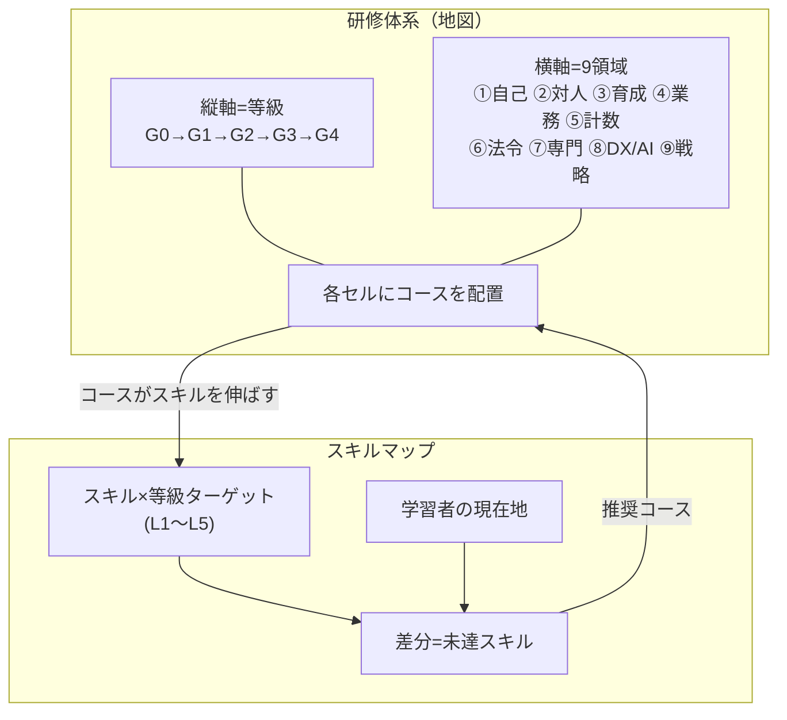
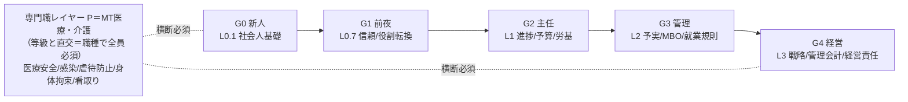
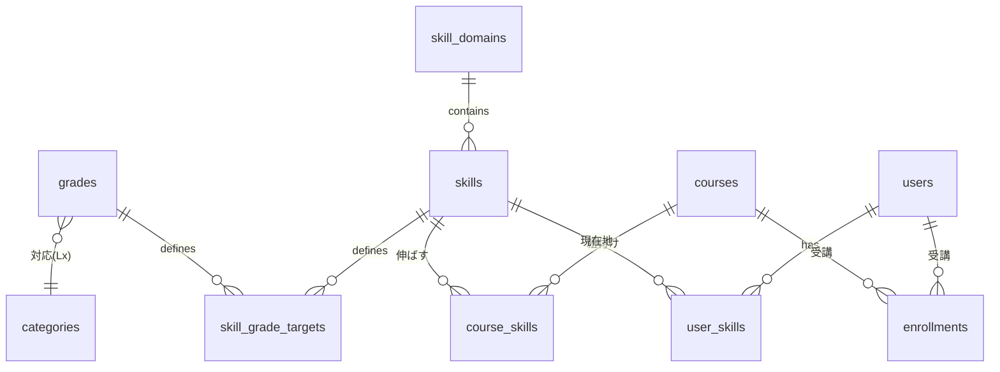
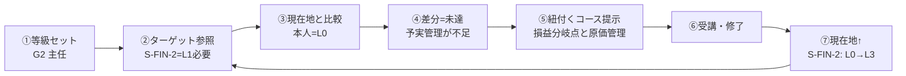

# 設計書：研修体系 & スキルマップ

> ステータス: 設計ドラフト v0.1（2026-06-19） — 合意形成用
> 対象: あわい屋ZEROS学習プラットフォーム（Next.js + Supabase）
> 方針: **既存資産（カテゴリ／コース／ロードマップ／MT必須研修）を最大限に活かしつつ、社会的に必要な研修を補完**。スキルは **スキル×等級マトリクス ＋ スキル↔コース紐付け** で表現する。
> 関連: `integration-design-care-training.md`（介護法定研修）／ `integration-design-zeros-ai.md`（診断連携）

---

## §0 目的とスコープ

### 0.1 何を作るか
本書は2つの成果物を定義する。

1. **研修体系（Training Framework）** … 「誰が・どの段階で・何を学ぶか」の全体地図。等級（キャリア段階）× 領域（ドメイン）の2軸で既存コースを位置づけ、抜けを埋める。
2. **スキルマップ（Skill Map）** … 「各等級で・各スキルを・どの習熟度まで」到達すべきかのマトリクス。さらに各スキルを伸ばすコースを紐付け、「学べば伸びる」を可視化する。

### 0.2 進め方（ユーザー確定 2026-06-19）
- **まず設計 → 順次実装**（本書が設計フェーズの成果物）。
- **今あるものを活かしつつ、社会的に必要なものを補完**。
- スキルは **おまかせ提案：スキル×等級マトリクス ＋ α（コース紐付け・習熟度スケール・将来の個人アセスメント）**。

### 0.3 既存資産の棚卸し（実装フェーズで土台にする）
| 区分 | 既存テーブル/seed | 内容 |
|------|------------------|------|
| 等級軸 | `categories` | L0.1 新社会人 / L0.7 主任前夜 / L1 主任・リーダー / L2 管理者 / L3 経営 |
| 必須研修 | `categories`(MT) + `seed_mt_catalog.sql` | MT-C 共通 / MT-M 医療 / MT-K 介護（ハラスメント・個人情報・医療安全・感染対策・災害BCP・虐待防止・身体拘束適正化・看取り・認知症ケア 等） |
| 横断テーマ | `seed_themetracks_catalog.sql` | CB（臨床と経営のあいだ）/ AI活用 / NG |
| 体系の束ね | `learning_paths` + `seed_roadmaps*.sql` | リーダー成長 / 医療・介護必須 / レベル別4種 |
| 進捗 | `enrollments` / `lesson_progress` / `quiz_attempts` | 受講・完了・採点 |
| 法定対応 | `mandatory_courses` | 必須研修の指定・締切 |

> **要点**: 研修体系の「縦軸（等級）」「必須研修」「束ね（ロードマップ）」はほぼ揃っている。**未実装は「スキルの明示的な定義」と「スキル↔コースの紐付け」**。本書のスキルマップはここを埋める。

---

## §1 研修体系（Training Framework）

### 1.1 2軸モデル
研修体系を **縦軸＝等級（キャリア段階）／横軸＝領域（ドメイン）** のマトリクスとして定義する。既存カテゴリは縦軸に対応する。横軸を新たに「9領域」として定義し、既存コースを各セルに配置する。

```
                ┌─────────────────────────────────────────────────────────┐
   等級 ＼ 領域 │ ① 自己 │ ② 対人 │ ③ 育成 │ ④ 業務 │ ⑤ 数値 │ ⑥ 法令 │ ⑦ 専門 │ ⑧ DX/AI │ ⑨ 戦略 │
  ─────────────┼────────┼────────┼────────┼────────┼────────┼────────┼────────┼─────────┼────────┤
  G4 経営(L3)  │   …    │   …    │  後継  │   …    │ 管理会計│ 経営責任│   …    │ AI戦略  │ 経営戦略│
  G3 管理(L2)  │   …    │   …    │  MBO   │ 予実管理│ 損益分岐│ 就業規則│   …    │   …     │ 中計   │
  G2 主任(L1)  │ 自己管理│        │        │ 進捗管理│  予算  │ 労基法 │   …    │   …     │3C/SWOT │
  G1 前夜(L0.7)│ 信頼/約束│ 役割転換│        │        │        │        │        │         │        │
  G0 新人(L0.1)│社会人基礎│        │        │        │        │        │        │         │        │
  ─────────────┴────────┴────────┴────────┴────────┴────────┴────────┴────────┴─────────┴────────┘
  ※ 医療・介護 専門職は ⑦専門 を MT（共通/医療/介護）で横断的にカバー（等級と直交する別レイヤー）
```

### 1.2 等級（縦軸）の定義
既存の `categories` をそのまま等級コードに昇格させる。

| 等級コード | 名称 | 既存カテゴリ | 対象像 |
|-----------|------|-------------|--------|
| **G0** | 新社会人 | L0.1 | 入社〜社会人基礎力 |
| **G1** | 一般・リーダー候補 | L0.7 | 主任打診前夜、現場の信頼づくり |
| **G2** | 主任・リーダー | L1 | チームを持つ、進捗・労務の基礎 |
| **G3** | 管理者（課長/部長） | L2 | 部門運営、目標管理、予実 |
| **G4** | 経営・役員 | L3 / L3-E | 全社戦略、経営責任 |
| **(P)** | 専門職レイヤー | MT | 医療・介護の法定/必須（等級と直交） |

> 専門職レイヤー（P）は「等級に関わらず職種で必須」のため、縦軸とは独立した**横断必須**として扱う（既存の MT ＋ `mandatory_courses` がこれに当たる）。

### 1.3 領域（横軸）9ドメインの定義
| # | 領域 | 説明 | 既存コース例（抜粋） |
|---|------|------|---------------------|
| ① | セルフマネジメント | 自己管理・倫理・信頼・約束 | 感情と信頼の自己管理 |
| ② | 対人・コミュニケーション | 接遇・傾聴・対話・関係構築 | 接遇とコミュニケーション(MT) |
| ③ | 人材育成・チーム | 1on1・動機づけ・後継者育成 | 後継者育成 / MBO/OKR |
| ④ | 業務マネジメント | 進捗・業務改善・品質・段取り | 進捗管理 |
| ⑤ | 計数・会計 | 予算・損益・管理会計 | 予算とは何か / 損益分岐点 / 経営者のための管理会計 |
| ⑥ | コンプライアンス・労務・リスク | 労基法・就業規則・危機管理 | 労基法の基本 / 就業規則・労務管理 / 危機管理 |
| ⑦ | 専門実務（医療・介護） | 医療安全・感染・看取り・虐待防止 | MT-C/M/K 各コース |
| ⑧ | DX・AI活用 | AI活用・デジタル戦略 | AI活用トラック / デジタル戦略・AI戦略 |
| ⑨ | 経営・戦略 | 全社戦略・事業戦略・中計 | 経営戦略の策定 / 中期経営計画 / 3C/SWOT/5フォース |

### 1.4 社会的に必要な研修の補完（ギャップ提案）
既存はリーダー育成＋医療介護法定がよく揃う。一方、**全業種で社会的に求められる基盤研修**に薄い箇所がある。下記を「補完候補」として提案（実装フェーズで取捨選択）。

| 優先 | 補完候補コース | 配置（領域/等級） | 根拠（社会的要請） |
|------|---------------|------------------|------------------|
| ★★★ | ハラスメント防止（全社版） | ⑥ / 全等級必須 | パワハラ防止法（中小も義務化済）。MTは医療介護向けのため**全社共通版**が必要 |
| ★★★ | 情報セキュリティ・個人情報保護（全社版） | ⑥/⑧ / 全等級 | 改正個情法。MT個人情報は医療文脈中心 |
| ★★★ | コンプライアンス／ビジネス倫理 基礎 | ⑥ / G0〜G2 | 内部統制・通報制度（公益通報者保護法） |
| ★★ | メンタルヘルス・ストレスチェック / セルフケア | ① / 全等級 | 労働安全衛生法（ストレスチェック義務） |
| ★★ | 安全衛生・労働災害防止 | ⑥/⑦ / 現場系 | 安衛法。職種横断の基礎 |
| ★★ | ダイバーシティ＆インクルージョン / 無意識バイアス | ②/③ / G2〜G4 | 多様性経営・女性活躍・障害者雇用 |
| ★★ | 事業継続（BCP）全社版 | ⑥ / G3〜G4 | MT災害BCPは介護向け。全社経営版 |
| ★ | カスタマーハラスメント対応 | ②/⑥ / 現場・管理 | 近年の社会課題、厚労省マニュアル |
| ★ | AIガバナンス・生成AI利用規程 | ⑧/⑥ / G2〜G4 | AI活用トラックの「守り」側 |
| ★ | 財務リテラシー基礎（非管理職向け） | ⑤ / G0〜G1 | 計数感覚の底上げ |

> ★の数は推奨優先度。実装フェーズで「採用/見送り/既存で代替」をユーザーと確定する。

### 1.5 充足度マップ（既存の厚み と 補充ポイント）
既存コース約90本（L0.1〜L3 ＋ MT ＋ テーマトラック）を領域×等級に配置した充足度。**緑＝既存で充足／黄＝一部・隣接でカバー／橙＝補充が必要な空白セル**。図は `docs/diagrams/fig2-coverage.png`（充足度マップ）・`fig3-heatmap.png`（スキル別の既存/補充）・`fig4-gaps.png`（補充候補リスト）。

| 領域 ＼ 等級 | G0 | G1 | G2 | G3 | G4 | 補充の要否 |
|------------|:--:|:--:|:--:|:--:|:--:|-----------|
| ① セルフ・倫理 | ◎ | ◎ | △ | △ | △ | ＋ メンタルヘルス |
| ② 対人・コミュ | △ | ○ | △ | ○ | △ | ＋ D&I / カスハラ |
| ③ 人材育成・チーム | — | ○ | ◎ | ◎ | ◎ | 充足 |
| ④ 業務マネジメント | ○ | ○ | ◎ | ◎ | △ | 概ね充足 |
| ⑤ 計数・会計 | ＋ | ◎ | ◎ | ◎ | ◎ | △ G0財務基礎 |
| ⑥ 法令・リスク | ＋ | ＋ | △ | ◎ | ◎ | **＋＋ 最大の穴** |
| ⑦ 専門（医療・介護） | ◎* | ◎* | ◎* | ◎* | ◎* | MT職種必須 |
| ⑧ DX・AI活用 | ＋ | △ | ○ | ○ | ○ | ＋ 基礎/ガバナンス |
| ⑨ 経営・戦略 | — | ○ | ○ | ◎ | ◎ | 充足 |

凡例: ◎既存充足(複数本) / ○既存あり / △一部・隣接でカバー / ＋補充必要 / ◎* MTで職種必須 / —対象外

**結論（活かす vs 補う）**:
- **活かす（既存が厚い）**: ③育成・⑤計数・⑨戦略 は L1〜L3 が充実。**新規作成はほぼ不要**、スキル紐付けだけで価値化できる。
- **補う（最優先）**: **⑥法令・リスクの G0〜G2** が最大の空白。全社版ハラスメント／情報セキュリティ／コンプラ倫理基礎（いずれも★★★）。MTは医療介護専用のため流用できない。
- **補う（次点）**: ①メンタルヘルス、②D&I、⑧AI基礎/ガバナンス、⑤G0財務基礎（★★〜★）。

---

## §2 スキルマップ（Skill Map）

### 2.1 構成要素
スキルマップは次の4要素で構成する。

1. **スキル（Skill）** … 伸ばす対象の能力。①〜⑨の領域に属する粒度で定義（例: 「進捗マネジメント」「予実管理」「感染対策」）。
2. **習熟度スケール（Proficiency Scale）** … 各スキルの到達度を測る共通ものさし（L1〜L5）。
3. **スキル×等級ターゲット（Target Matrix）** … 「この等級では、このスキルをL◯まで」という期待値＋行動指標。
4. **スキル↔コース紐付け（Skill ⇄ Course）** … 各コースがどのスキルを伸ばすか。「学べば埋まる」を実現する核。

### 2.2 習熟度スケール（L1〜L5）
| レベル | 名称 | 状態の定義 |
|--------|------|-----------|
| **L1** | 認知 | 用語・重要性を知っている。指示があれば最低限こなせる |
| **L2** | 実践（補助付き） | 標準手順を、助言を受けながら実行できる |
| **L3** | 自立 | 一人で安定して遂行できる。例外にもある程度対応 |
| **L4** | 応用・指導 | 状況に応じ最適化し、他者に教えられる |
| **L5** | 変革・牽引 | 仕組み化・標準づくりで組織を牽引する |

### 2.3 スキル定義（領域別・初版ドラフト）
領域ごとに代表スキルを定義。**既存コースから機械的に抽出した実在スキル**を中心に、§1.4の補完を含む。

| 領域 | スキルコード | スキル名 |
|------|------------|---------|
| ① 自己 | S-SELF-1 | 自己管理・セルフコントロール |
| ① 自己 | S-SELF-2 | 信頼構築・約束遂行 |
| ① 自己 | S-SELF-3 | メンタルヘルス・ストレスケア（補完） |
| ② 対人 | S-COMM-1 | 接遇・傾聴 |
| ② 対人 | S-COMM-2 | 対話・関係構築・対立調整 |
| ③ 育成 | S-PEOPLE-1 | 動機づけ・1on1 |
| ③ 育成 | S-PEOPLE-2 | 目標管理（MBO/OKR） |
| ③ 育成 | S-PEOPLE-3 | 後継者・次世代育成 |
| ④ 業務 | S-OPS-1 | 進捗・タスクマネジメント |
| ④ 業務 | S-OPS-2 | 業務改善・品質 |
| ⑤ 数値 | S-FIN-1 | 予算・計数感覚 |
| ⑤ 数値 | S-FIN-2 | 予実管理・原価/損益分岐 |
| ⑤ 数値 | S-FIN-3 | 管理会計・経営数値 |
| ⑥ 法令 | S-COMP-1 | 労務・労基法 |
| ⑥ 法令 | S-COMP-2 | コンプライアンス・倫理 |
| ⑥ 法令 | S-COMP-3 | ハラスメント防止 |
| ⑥ 法令 | S-COMP-4 | 情報セキュリティ・個人情報保護 |
| ⑥ 法令 | S-COMP-5 | リスク・危機管理・BCP |
| ⑦ 専門 | S-CARE-1 | 医療安全・医薬品/機器安全 |
| ⑦ 専門 | S-CARE-2 | 感染対策・衛生 |
| ⑦ 専門 | S-CARE-3 | 介護倫理・虐待防止・身体拘束適正化 |
| ⑦ 専門 | S-CARE-4 | 看取り・ターミナルケア・認知症ケア |
| ⑧ DX/AI | S-DX-1 | AI活用・プロンプト/実務組込み |
| ⑧ DX/AI | S-DX-2 | デジタル/AI戦略・ガバナンス |
| ⑨ 戦略 | S-STR-1 | 環境分析（3C/SWOT/5フォース） |
| ⑨ 戦略 | S-STR-2 | 経営戦略・事業戦略 |
| ⑨ 戦略 | S-STR-3 | 中期経営計画・実行 |

### 2.4 スキル×等級ターゲット・マトリクス（抜粋・初版）
セルの値＝その等級で期待する習熟度（L1〜L5）。空欄＝対象外（必須でない）。

| スキル ＼ 等級 | G0 新人 | G1 前夜 | G2 主任 | G3 管理 | G4 経営 |
|---------------|:------:|:------:|:------:|:------:|:------:|
| S-SELF-1 自己管理 | L2 | L3 | L3 | L4 | L4 |
| S-SELF-2 信頼構築 | L1 | L3 | L3 | L4 | L4 |
| S-COMM-1 接遇・傾聴 | L2 | L3 | L3 | L4 | L4 |
| S-PEOPLE-1 動機づけ・1on1 | — | L1 | L3 | L4 | L4 |
| S-PEOPLE-2 目標管理 | — | — | L2 | L4 | L4 |
| S-PEOPLE-3 後継者育成 | — | — | — | L3 | L5 |
| S-OPS-1 進捗管理 | L1 | L2 | L4 | L4 | L3 |
| S-FIN-1 計数感覚 | L1 | L1 | L2 | L3 | L4 |
| S-FIN-2 予実管理 | — | — | L1 | L4 | L4 |
| S-FIN-3 管理会計 | — | — | — | L3 | L5 |
| S-COMP-1 労務・労基法 | L1 | L1 | L3 | L4 | L4 |
| S-COMP-3 ハラスメント防止 | L2 | L2 | L3 | L4 | L4 |
| S-COMP-4 情報セキュリティ | L2 | L2 | L3 | L3 | L4 |
| S-COMP-5 危機管理・BCP | — | — | L2 | L3 | L5 |
| S-STR-1 環境分析 | — | — | L2 | L3 | L4 |
| S-STR-2 経営戦略 | — | — | — | L2 | L5 |
| S-DX-1 AI活用 | L1 | L2 | L2 | L3 | L3 |

> ⑦専門（S-CARE-*）は等級ではなく**職種**で必須化するため、本マトリクスとは別に「職種×スキル」表（医療職/介護職それぞれ全員 L3 必須 等）を持つ。MT＋`mandatory_courses` がこれを担う。

### 2.5 スキル ⇄ コース 紐付け（核心）
各コースが「どのスキルを・どの程度伸ばすか」を持たせる。これにより「ターゲット未達のスキル → 推奨コース」を自動提示できる（既存の診断連携 `assign-roadmap` とも接続可能）。

例（既存コース → スキル）:
| コース（既存） | 伸ばすスキル | 到達貢献 |
|---------------|------------|---------|
| 進捗管理 ─ 管理されない進捗の作り方 | S-OPS-1 | →L4 |
| 予算とは何か ─ 主任が知っておくべき範囲 | S-FIN-1 | →L2 |
| 損益分岐点と原価管理 | S-FIN-2 | →L3 |
| 3C/SWOT/5フォース | S-STR-1 | →L2 |
| 後継者育成 ─ 次の主任を育てる視点 | S-PEOPLE-3 | →L3 |
| 主任が知らないとまずい労基法の基本 | S-COMP-1 | →L3 |
| ハラスメント防止（MT/補完） | S-COMP-3 | →L3 |
| 感染対策の基礎 | S-CARE-2 | →L3 |

---

## §3 データモデル設計（実装フェーズ用）

既存スキーマに**加算**する形で、以下の新規テーブルを提案（migrationで追加）。既存 `categories`/`courses`/`learning_paths` は変更しない。

### 3.1 新規テーブル
```sql
-- 等級マスタ（既存 categories の「Lx」を正規化。最初は categories から参照でも可）
grades (
  id, code,            -- 'G0'..'G4', 'P'
  name, level int,     -- 並び順
  category_id          -- 既存 categories への対応づけ（任意）
)

-- スキル領域（①〜⑨）
skill_domains ( id, code, name, sort_order )

-- スキル
skills (
  id, domain_id (FK),
  code,                -- 'S-OPS-1' 等
  name, description,
  applies_by: 'grade' | 'role',  -- 等級軸 or 職種軸（⑦専門はrole）
  sort_order, is_active
)

-- 習熟度スケール（L1〜L5。固定でもテーブル化でも可）
proficiency_levels ( level int PK, name, description )

-- スキル×等級ターゲット（マトリクスのセル）
skill_grade_targets (
  skill_id (FK), grade_id (FK),
  target_level int,            -- 1..5
  behavior_indicator text,     -- 行動指標（任意）
  is_required bool,
  PRIMARY KEY (skill_id, grade_id)
)

-- スキル↔コース紐付け
course_skills (
  course_id (FK), skill_id (FK),
  contribution_level int,      -- このコース修了で到達しうるレベル
  weight numeric default 1,    -- 主従（メイン/サブ）
  PRIMARY KEY (course_id, skill_id)
)

-- （将来）個人のスキル現在地：自己/上長評価・修了からの自動付与
user_skills (
  user_id (FK), skill_id (FK),
  current_level int,
  source: 'self' | 'manager' | 'course',
  assessed_at,
  PRIMARY KEY (user_id, skill_id)
)
```

### 3.2 既存との接続点
- `course_skills.course_id` → 既存 `courses.id`。
- `grades` ↔ 既存 `categories`（Lx）を `category_id` で対応づけ。
- `user_skills(source='course')` は `enrollments.status='completed'` ＋ `course_skills.contribution_level` から**自動算出**できる（バッチ or ビュー）。
- 未達スキル → 推奨コース提示は、既存の診断連携 `/api/integrations/assign-roadmap` と同じ思想で拡張可能。

### 3.3 RLS / 可視性
既存方針に合わせる：マスタ（skills/targets/course_skills）は **Global（organization_id NULL）読み取り公開＋管理者書込**、`user_skills` は本人＋自組織管理者のみ。既存 `courses` のRLSパターンを踏襲。

---

## §4 実装ロードマップ（段階リリース）

| フェーズ | 内容 | 主な成果物 | 依存 |
|---------|------|-----------|------|
| **P0（本書）** | 設計合意 | 本ドキュメント | — |
| **P1** | スキル/体系の**データ確定** | skills・skill_domains・skill_grade_targets の**確定seed（CSV/SQL）** | P0合意 |
| **P2** | **DB追加** | migration（§3のテーブル）＋ RLS | P1 |
| **P3** | **コース紐付けseed** | `course_skills` seed（既存コース → スキル） | P2 |
| **P4** | **管理UI** | `/admin/skills`（スキル/ターゲット/紐付け編集） | P2,P3 |
| **P5** | **学習者UI** | ダッシュボードにスキルマップ表示（現在地 vs ターゲット、未達→推奨コース） | P3 ＋ user_skills |
| **P6** | **補完研修コース** | §1.4 の採用コースを既存オーサリングで投入 | P1合意 |

> P1〜P3 は「データを作る」フェーズ、P4〜P5 が「UIで見せる」フェーズ。ユーザー方針「まず設計→順次実装」に沿い、P1の**データ確定**を次の論点とする。

---

## §5 次に決めること（オープン論点）

1. **等級の正式名称**：G0〜G4 のラベルを既存 L表記のままにするか、人事等級（例: J1/M1…）に寄せるか。
2. **§1.4 補完研修の採否**：★★★（ハラスメント全社版／情報セキュリティ／コンプラ基礎）を最優先で作るか。
3. **習熟度スケール**：L1〜L5 の5段階で確定か、3段階（知る/できる/教える）に簡素化するか。
4. **専門職レイヤー（⑦）の扱い**：職種マスタを新設するか、当面 MT＋mandatory_courses で代替するか。
5. **スキルの粒度**：§2.3 の27スキルで確定か、増減するか。
6. **P5の個人スキル現在地**：修了からの自動付与のみで始めるか、自己/上長評価も入れるか。

---

### 付録B：図解（Mermaid）

#### B-1 全体俯瞰：研修体系 → スキルマップ


#### B-2 等級の階段 ＋ 専門職レイヤー


#### B-3 データモデル（ER）


#### B-4 運用フロー（学べば未達が埋まる）


### 付録A：本書が前提とした既存資産（実在確認済み）
- カテゴリ: `seed_l01/l07/l1/l2_l3_catalog.sql`, `seed_mt_catalog.sql`, `seed_themetracks_catalog.sql`
- ロードマップ: `seed_roadmaps.sql`, `seed_roadmaps_per_level.sql`
- 進捗/採点: `enrollments`, `lesson_progress`, `quiz_attempts`（`20260618120000_add_quiz_attempts.sql`）
- 法定対応: `mandatory_courses`, `docs/integration-design-care-training.md`
